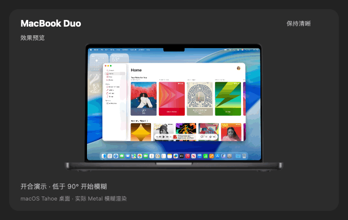

# MacBook Duo

根据 MacBook 屏幕开合角度，为内建屏幕桌面添加渐变模糊与透视效果的原生 macOS 实验应用。使用 SwiftUI、AppKit、ScreenCaptureKit 和 Metal，无第三方包依赖。

## 动态预览



10 秒循环演示：屏幕低于 90° 后逐渐模糊，展开后恢复清晰。GIF 使用 Apple 官方 macOS Tahoe 26 桌面示例（菜单栏、Dock、小组件和 Music 窗口），与应用共用开合曲线、角度阈值和 Metal 着色器；机身动画采用离线透视合成，并非设置窗口录屏。应用内预览可显示授权后的真实桌面快照。

[重新生成演示动画](docs/PREVIEW.md)

## 功能

- 自定义开始模糊角度（默认 90°），展开后恢复清晰。
- 菜单栏常驻：效果显示时图标为蓝色，清晰待机或未生效时为白色。
- 保存启用状态，支持登录后自动启动；关闭设置窗口后继续后台运行。
- MacBook 实机外观预览，使用本机桌面快照和实际渲染器演示开合效果。
- 普通窗口内的截图测试、角度校准及高级参数。
- 独立重启组件，确保授权后先退出旧进程再启动应用。

## 环境

需要 macOS、Apple Command Line Tools（Swift 编译器及 macOS SDK）、Metal，以及能提供铰链角度的 MacBook。传感器使用未公开 HID 通路，不保证所有机型可用。外接显示器不作为实时效果目标。

已在 Apple Silicon / Swift 6.3.3 工具链构建验证。`Info.plist` 声明 macOS 14.0，但构建脚本未固定 deployment target；最终最低系统版本受工具链默认值影响，尚未验证 macOS 14 兼容性。没有 Xcode 工程文件。

## 本地构建

```sh
xcode-select --install # 已安装 Command Line Tools 可跳过
./build.sh
```

生成 `MacBook Duo.app`，使用当前机器架构和 ad-hoc 签名。Metal 着色器在运行时编译。

```sh
open "MacBook Duo.app"
```

若本机已有同一应用，请勿同时运行两个副本：当前源码保留原 Bundle ID，两份应用会共享偏好设置和权限身份。本仓库整理过程仅构建验证，未运行副本。

## 使用

1. 调整“开始模糊角度”，点击“启用效果”。
2. 在系统设置的“屏幕与系统音频录制”中允许 MacBook Duo；如需重启，返回应用点击“授权后重启”。
3. 点击“完成，后台运行”，合拢屏幕至阈值以下查看效果。
4. 可打开“登录后自动启动”；后续通过菜单栏返回设置。

打开设置时暂缓显示桌面覆盖层，关闭设置后继续。菜单栏退出应用会保留启用偏好；“停止功能”会取消下次启动自动恢复。按 **⌘⇧Esc** 可立即停止并恢复设置。

预览使用桌面快照，点击刷新按钮更新，不持续录制预览。截图与实时效果均在本机处理，不上传，不写入录像文件。透视后的视觉位置与实际点击位置可能不同，精确操作前请展开屏幕恢复清晰。全屏应用、Spaces 和受保护视频尚未全面验证。

## 验证

```sh
./test.sh          # 角度、演示动画、菜单栏裁剪和权限状态逻辑
./test.sh --gpu    # 额外验证 Metal 初始化和空闲/唤醒行为，需要桌面与 GPU 环境
```

测试保留断言，不使用 `-O`。`Tests/BackgroundLifecycleTests.swift` 另包含需要 AppKit 桌面环境的生命周期与状态图标检查；不属于默认脚本。授权、登录启动、真实合盖及重启流程需要人工在目标机器验收。

## 目录

- `Sources/`：界面、传感器、桌面捕获、Metal 渲染和后台控制。
- `Helpers/`：独立的应用重启组件。
- `Assets/`：图标、设备预览与素材来源。
- `Tests/`：逻辑与桌面环境测试。
- `docs/`：[权限说明](docs/PERMISSIONS.md)、[性能记录](docs/PERFORMANCE.md)。
- `build.sh` / `test.sh`：构建与测试入口。

## 来源与许可

渲染参考模型见 [Atomicx7/Duo-animation](https://github.com/Atomicx7/Duo-animation)，其注明的 Swift 原型为 `elijah-semyonov/DuoLikeAnimation`；铰链读取参考 [samhenrigold/LidAngleSensor](https://github.com/samhenrigold/LidAngleSensor)。本项目使用底部水平铰链的 Metal 实现。

设备照片归 Apple 所有，详见 [素材来源](Assets/SOURCES.md)。引用来源不等于获得再分发许可。当前尚未为本项目指定开源许可证，因此不宣称代码或第三方素材已获开放许可；发布前应确定所需许可及素材使用方式。
